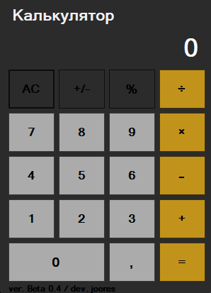

# Калькулятор на C++ (Windows Forms)

Десктопное приложение-калькулятор с графическим интерфейсом, разработанное на C++/CLI с использованием Windows Forms в среде Visual Studio. Учебный проект для практики ООП, работы с GUI и обработки пользовательских событий.

## 📋 Функционал

- [x] Базовые арифметические операции: `+`, `-`, `×`, `÷`
- [x] Проценты (`%`)
- [x] Смена знака числа (`+/-`)
- [x] Очистка поля ввода (`AC`)
- [x] Поддержка десятичных чисел
- [x] Обработка деления на ноль

## 🖼 Скриншот



## 🛠 Технологии

- **Язык:** C++/CLI (диалект C++ для .NET)
- **GUI-фреймворк:** Windows Forms (.NET Framework)
- **Среда разработки:** Microsoft Visual Studio 2022
- **Платформа:** Windows

## 🚀 Как запустить

### Вариант 1: Готовая сборка

1. Перейди в раздел [Releases](../../releases) этого репозитория.
2. Скачай `Calculator.exe`.
3. Запусти — установка не требуется.

*Требуется .NET Framework 4.7.2 или выше (есть в Windows 10/11 по умолчанию).*

### Вариант 2: Сборка из исходников

1. Клонируй репозиторий:
   ```bash
   git clone https://github.com/joores/FirstCalculator.git

Примечание по безопасности:
При первом запуске Calculator.exe Windows может показать предупреждение «Система Windows защитила ваш компьютер». Это стандартное поведение для новых приложений без коммерческой цифровой подписи. Чтобы запустить программу:

1. Нажмите «Подробнее» (More info).
2. Нажмите «Выполнить в любом случае» (Run anyway)
